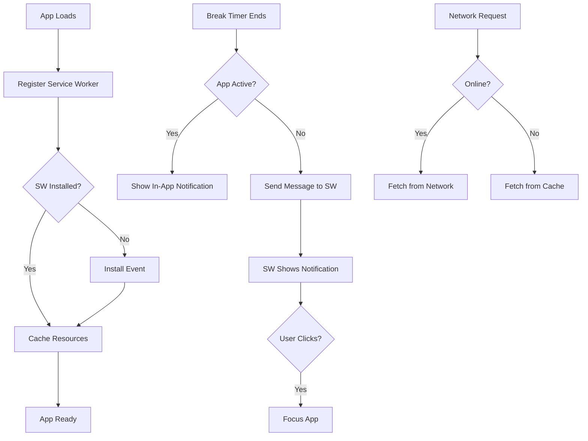

# PWA Implementat

ion Plan

## Overview

Transform Gymbro into a Progressive Web App (PWA) that can be installed on devices, works offline, and sends notifications when break timers complete—even when the app is closed or in the background.

## Architecture

The PWA implementation consists of:

1. **Web App Manifest** - Defines app metadata, icons, and installability
2. **Service Worker** - Handles offline caching, background notifications, and app lifecycle
3. **Service Worker Registration** - Registers the service worker on app load
4. **Notification Integration** - Updates notification system to work with service worker

## Implementation Details

### 1. Web App Manifest (`public/manifest.json`)

Create a web app manifest with:

- App name, short name, description
- Icons (multiple sizes: 192x192, 512x512 minimum)
- Start URL (`/`)
- Display mode (`standalone` for app-like experience)
- Theme colors matching the app
- Orientation preference

**Icons**: Since the app currently uses an emoji (💪) as favicon, we'll create SVG-based icons that can be converted to PNGs, or use a simple approach with the emoji embedded in SVG.

### 2. Service Worker (`public/sw.js`)

Implement a service worker with:**Offline Support:**

- Cache strategy for static assets (CSS, JS, HTML)
- Network-first strategy for API calls (when backend is added)
- Cache-first for static resources
- Version-based cache invalidation

**Notification Handling:**

- Listen for `push` events (for future server-sent notifications)
- Listen for `notificationclick` events to handle user interaction
- Show notifications from service worker context

**Lifecycle:**

- Install event - cache essential resources
- Activate event - clean up old caches
- Fetch event - serve cached content when offline

### 3. Service Worker Registration (`src/sw-register.ts`)

Create a registration module that:

- Checks for service worker support
- Registers the service worker on app load
- Handles updates and prompts user to refresh
- Manages service worker lifecycle

### 4. Notification System Updates

**Update `src/pages/gymtime/notification.ts`:**

- Keep existing Notification API for in-app notifications
- Add service worker notification support for background notifications
- Use `navigator.serviceWorker.ready` to get service worker registration
- Send messages to service worker to trigger notifications

**Service Worker Notification Handler:**

- Listen for `message` events from the main thread
- Show notifications using `registration.showNotification()`
- Handle notification clicks to focus the app

### 5. HTML Updates

Update all HTML files to:

- Link to manifest: `<link rel="manifest" href="/manifest.json">`
- Add theme color meta tag
- Add apple-touch-icon for iOS
- Add mask-icon for Safari

### 6. Vite Configuration

Update `vite.config.ts` to:

- Copy `public/manifest.json` to dist
- Copy `public/sw.js` to dist root
- Ensure service worker is served with correct MIME type
- Configure build to handle service worker scope

### 7. Icon Generation

Create app icons:

- Generate 192x192 and 512x512 PNG icons from SVG
- Use the 💪 emoji or create a simple gym-themed icon
- Place icons in `public/icons/` directory

## File Changes

### New Files

- `public/manifest.json` - Web app manifest
- `public/sw.js` - Service worker
- `public/icons/icon-192.png` - 192x192 icon
- `public/icons/icon-512.png` - 512x512 icon
- `src/sw-register.ts` - Service worker registration

### Modified Files

- `src/main.ts` - Import service worker registration
- `src/pages/gymtime/notification.ts` - Add service worker notification support
- `index.html` - Add manifest link and meta tags
- `gymtime/index.html` - Add manifest link and meta tags
- `exercises/index.html` - Add manifest link and meta tags
- `programs/index.html` - Add manifest link and meta tags
- `settings/index.html` - Add manifest link and meta tags
- `workouts/index.html` - Add manifest link and meta tags
- `vite.config.ts` - Configure public assets copying

## Implementation Flow

## Testing Checklist

- [ ] App can be installed on mobile device
- [ ] App can be installed on desktop (Chrome, Edge)
- [ ] App works offline (cached pages load)
- [ ] Break timer notifications work when app is active
- [ ] Break timer notifications work when app is in background
- [ ] Break timer notifications work when app is closed
- [ ] Clicking notification opens/focuses the app
- [ ] Service worker updates properly on new deployments
- [ ] Cache invalidation works correctly

## Browser Support

- Chrome/Edge: Full PWA support
- Firefox: Partial (installable, notifications work)
- Safari iOS: Installable (Add to Home Screen), limited service worker support
- Safari macOS: Full PWA support (macOS 11+)

## Notes

- Service worker must be served from root or same directory as app
- HTTPS required for service workers (localhost exception for development)
- Notification permission must be requested by user interaction